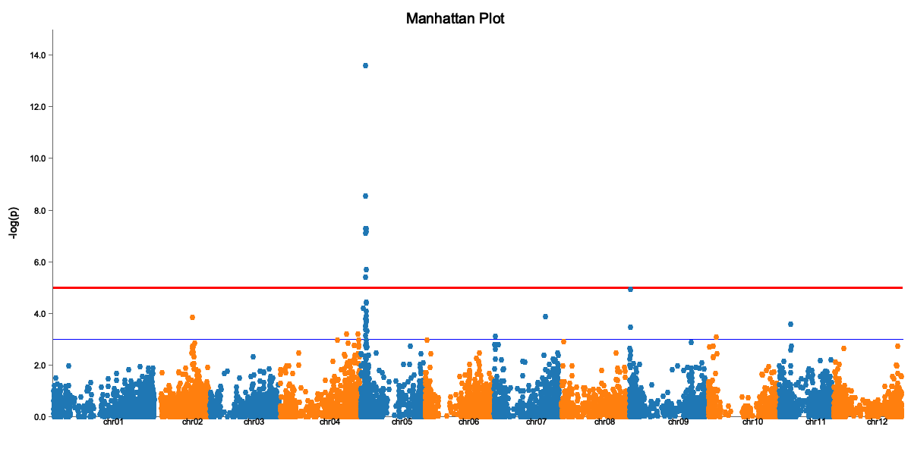
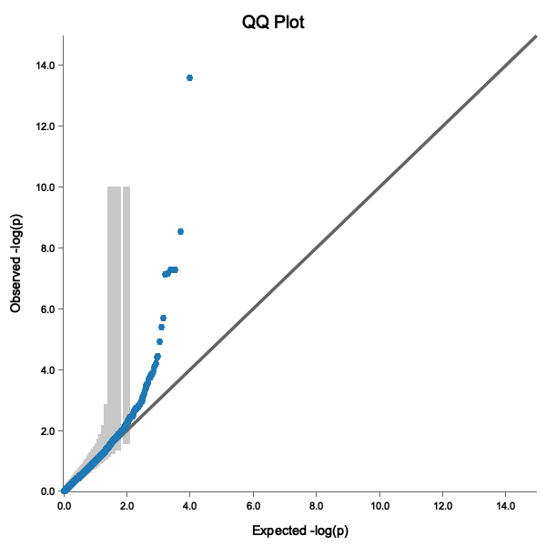

# Your First GWAS Analysis

This tutorial walks you through a complete GWAS analysis from start to finish using Binx.

## What You'll Learn

- How to prepare your data for Binx
- Running a basic GWAS analysis
- Interpreting and visualizing results
- Extracting significant QTLs

## Prerequisites

- Binx installed ([Installation Guide](../getting-started/installation.md))
- Genotype data (VCF or dosage format)
- Phenotype data (CSV/TSV)

## Sample Data

For this tutorial, we'll use a tetraploid potato dataset from the R/GWASpoly package.

**Download the sample files:**
- [potato_geno.csv](https://raw.githubusercontent.com/alex-sandercock/Binx/main/potato_geno.csv) - Genotype data (~9,888 markers, ~1,249 samples)
- [potato_pheno.csv](https://raw.githubusercontent.com/alex-sandercock/Binx/main/potato_pheno.csv) - Phenotype data (vine maturity trait)

> **Citation:** Rosyara, U.R., De Jong, W.S., Douches, D.S., & Endelman, J.B. (2016). Software for genome-wide association studies in autopolyploids and its application to potato. *The Plant Genome* 9(2).

## Step 1: Examine Your Data

First, let's look at our input files:

```bash
# Check genotype file structure
head -3 potato_geno.csv
```

```
marker,chrom,bp,AF5392-8,AF5393-1,AF5445-2,...
solcap_snp_c2_36608,chr01,508800,1,0,1,...
solcap_snp_c2_36658,chr01,527068,4,3,2,...
```

```bash
# Check phenotype file
head -5 potato_pheno.csv
```

```csv
id,vine.maturity,env
AF5033-13,4.174,Hancock15
AF5153-11,7.674,Hancock15
AF5281-4,4.174,Hancock15
...
```

Verify sample counts match:

```bash
# Count samples in genotype file (columns - 3)
head -1 potato_geno.csv | awk -F',' '{print NF-3, "samples"}'

# Count samples in phenotype file (lines - 1)
wc -l < potato_pheno.csv | awk '{print $1-1, "samples"}'
```

## Step 2: Compute Kinship Matrix (Optional)

The kinship matrix captures genetic relationships. While Binx can auto-generate this using gwaspoly-rs's `set_k()` function, computing it separately allows reuse across multiple traits:

```bash
binx kinship \
  --geno potato_geno.csv \
  --ploidy 4 \
  --output kinship.tsv
```

Check the kinship matrix:

```bash
# View corner of matrix
head -5 kinship.tsv | cut -f1-5
```

Diagonal values should be approximately 1.0. Off-diagonal values represent relatedness between samples.

## Step 3: Run GWAS

Now run the association analysis:

```bash
binx gwas \
  --geno potato_geno.csv \
  --pheno potato_pheno.csv \
  --trait vine.maturity \
  --kinship kinship.tsv \
  --ploidy 4 \
  --models additive \
  --out gwas_results.csv
```

This will:
1. Load genotypes and phenotypes
2. Match samples between files
3. Fit a mixed model for each marker
4. Output association statistics

### Understanding the Output

```bash
head gwas_results.csv
```

```csv
marker_id,chrom,pos,model,score,p_value,effect,n_obs,threshold
solcap_snp_c2_36608,chr01,508800,additive,0.64,0.227,0.084,1249,NA
solcap_snp_c2_36658,chr01,527068,additive,0.29,0.508,0.050,1249,NA
...
```

Key columns:
- `score`: -log10 transformed p-value (higher = more significant)
- `p_value`: Probability of seeing this effect by chance
- `effect`: How much the trait changes per allele dosage unit
- `n_obs`: Sample size (non-missing)
- `threshold`: Significance threshold used

## Step 4: Calculate Significance Threshold

Determine the significance threshold using M.eff (recommended, accounts for LD):

```bash
binx threshold \
  --results gwas_results.csv \
  --method m.eff \
  --geno potato_geno.csv \
  --ploidy 4 \
  --alpha 0.05
```

Output:
```
Method: M.eff
Number of tests: 9886
Effective tests (M.eff): 6234
P-value threshold: 8.02e-06
-log10(p) threshold: 5.10
```

## Step 5: Create Visualizations

### Manhattan Plot

```bash
binx plot \
  --input gwas_results.csv \
  --plot-type manhattan \
  --model additive \
  --threshold 5.1 \
  --title "Vine Maturity GWAS" \
  --output manhattan.png
```



The Manhattan plot shows:
- X-axis: Genomic position (by chromosome)
- Y-axis: -log10(p-value)
- Red line: Significance threshold
- Peaks above the line are significant associations

### QQ Plot

```bash
binx plot \
  --input gwas_results.csv \
  --plot-type qq \
  --model additive \
  --output qq.png
```



A good QQ plot shows:
- Points following the diagonal line (no inflation)
- Deviation only at the tail (true associations)
- Points within the 95% confidence band

## Step 6: Extract Significant QTLs

First, run GWAS with threshold calculation to get a threshold column:

```bash
binx gwas \
  --geno potato_geno.csv \
  --pheno potato_pheno.csv \
  --trait vine.maturity \
  --kinship kinship.tsv \
  --ploidy 4 \
  --models additive \
  --threshold m.eff \
  --out gwas_results.csv
```

Then extract significant QTLs:

```bash
binx qtl \
  --input gwas_results.csv \
  --bp-window 5000000 \
  --output significant_qtls.csv
```

```bash
cat significant_qtls.csv
```

```csv
marker_id,chrom,pos,model,score,effect,threshold
solcap_snp_c2_25522,chr05,4561232,additive,6.12,0.52,5.10
PotVar0067031,chr05,5193547,additive,5.89,0.48,5.10
```

> **Note:** The input file must have a `threshold` column. Use `binx gwas --threshold` to generate results with thresholds.

## Step 7: Interpret Results

For each significant QTL:

1. **Effect size**: A positive effect means the alternate allele increases the trait
2. **Position**: Look up genes near the QTL position
3. **MAF**: Very rare variants may be false positives

### Candidate Gene Analysis

Once you have QTL positions, you can:
- Look up nearby genes in genome browsers
- Check if known candidate genes are in the region
- Examine the LD block around the peak marker

## Complete Script

Here's the full analysis as a script:

```bash
#!/bin/bash
set -e

# Configuration (using downloaded sample files)
GENO="potato_geno.csv"
PHENO="potato_pheno.csv"
TRAIT="vine.maturity"
PLOIDY=4
OUTDIR="results"

# Create output directory
mkdir -p $OUTDIR

# Step 1: Compute kinship
echo "Computing kinship matrix..."
binx kinship --geno $GENO --ploidy $PLOIDY --out $OUTDIR/kinship.tsv

# Step 2: Run GWAS with threshold calculation
echo "Running GWAS..."
binx gwas \
  --geno $GENO \
  --pheno $PHENO \
  --trait $TRAIT \
  --kinship $OUTDIR/kinship.tsv \
  --ploidy $PLOIDY \
  --models additive \
  --threshold m.eff \
  --out $OUTDIR/gwas_results.csv

# Step 3: Generate plots
echo "Creating plots..."
binx plot --input $OUTDIR/gwas_results.csv --plot-type manhattan --output $OUTDIR/manhattan.png
binx plot --input $OUTDIR/gwas_results.csv --plot-type qq --output $OUTDIR/qq.png

# Step 4: Extract QTLs
echo "Extracting QTLs..."
binx qtl --input $OUTDIR/gwas_results.csv --bp-window 5000000 --output $OUTDIR/qtls.csv

echo "Done! Results in $OUTDIR/"
```

## Next Steps

- Try different [genetic models](../reference/genetic-models.md)
- Use [LOCO](gwas.md#loco-analysis) for better p-value calibration
- Analyze [multiple environments](multi-environment.md)
- Explore [polyploid-specific models](polyploid-analysis.md)

## Troubleshooting

### "Sample ID mismatch" error

Ensure sample IDs in phenotype file exactly match genotype column headers (case-sensitive).

### Inflated QQ plot (points above diagonal)

If your QQ plot shows systematic deviation above the diagonal line:
- Try including principal components (`--n-pc 5`)
- Check for population structure in your data
- Use LOCO kinship (`--loco`)

### No significant results

- Check if trait is heritable
- Ensure sufficient sample size (>100 recommended)
- Try different genetic models
